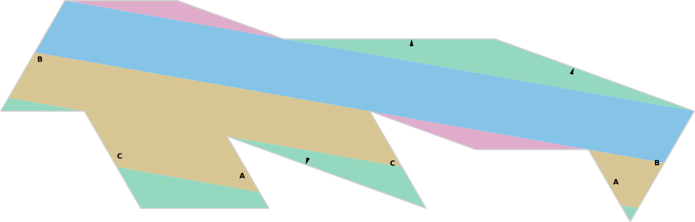

<p align="center">
    
</p>

<h1><p align="center">vue-flatsurf</p></h1>

<p align="center">
  
  <a href="https://github.com/flatsurf/vue-flatsurf/actions/workflows/test.yml"></a>
</p>

<p align="center">Visualization for flatsurf</p>
<hr>

This package provides interactive visualization for many of the objects in the [flatsurf suite](https://flatsurf.github.io) such as triangulated surfaces and their flow decompositions. It is written in [TypeScript](https://typescriptlang.org/) and [vue.js](https://vuejs.org) to run in the browser. For the most part, this project exists as the frontend code for [ipyvue-flatsurf](https://github.com/flatsurf/ipyvue-flatsurf) which implements [Jupyter](https://jupyter.org) widgets for [sage-flatsurf](https://github.com/flatsurf/sage-flatsurf).



Install from NPM
----------------

This package is available on [NPM](https://npmjs.com/package/vue-flatsurf). To use `vue-flatsurf` in your project, install it with `yarn add --dev vue-flatsurf` or the corresponding NPM command.

Run Demo Application
--------------------

The demo application [App.vue](demo/App.vue) is deployed at https://flatsurf.github.io/vue-flatsurf/app/. To run it locally, install the dependencies with `yarn` and run the app with `yarn serve`.

Run Tests
---------

The project has a small amount of unit tests. During development they can be run with
```
yarn test
```

Release Cycle
-------------

We release this package frequently and upload a new version to [NPM](https://www.npmjs.com/package/vue-flatsurf), typically with most merges into the master branch. To release a new version, checkout the master branch locally, and run `rever VERSION`.

How to Cite this Project
------------------------

If you have used this project in the preparation of a publication, please cite
it as described [on our zenodo page](https://zenodo.org/record/5192364).
